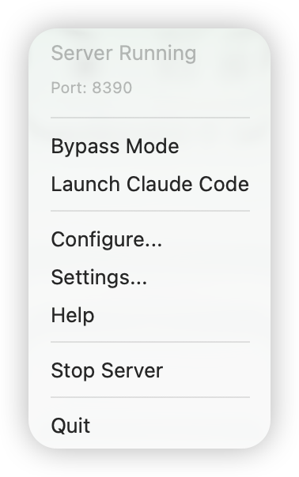
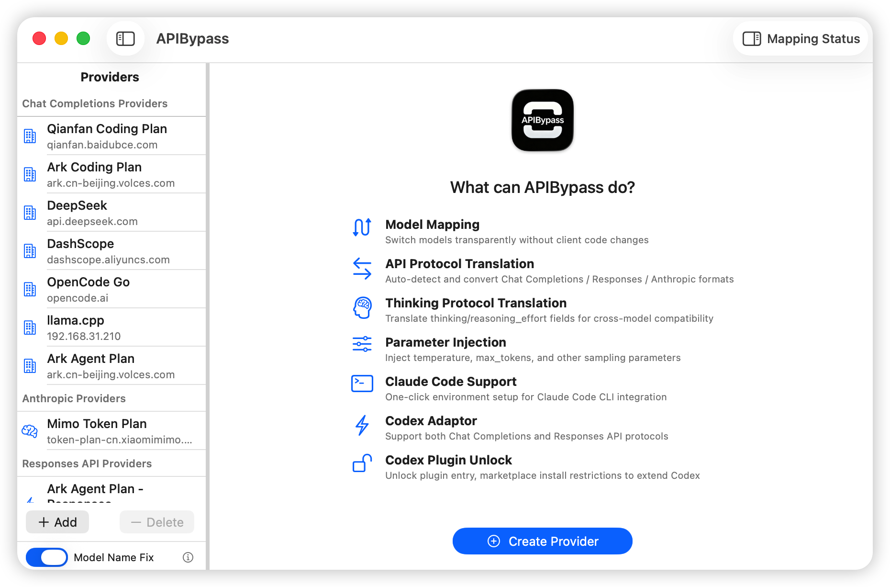
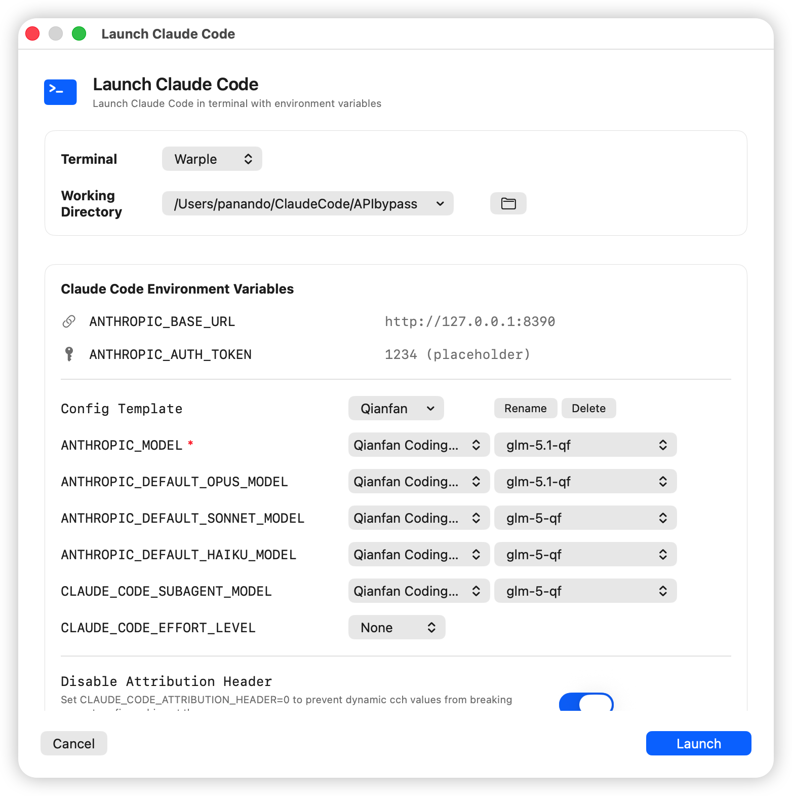
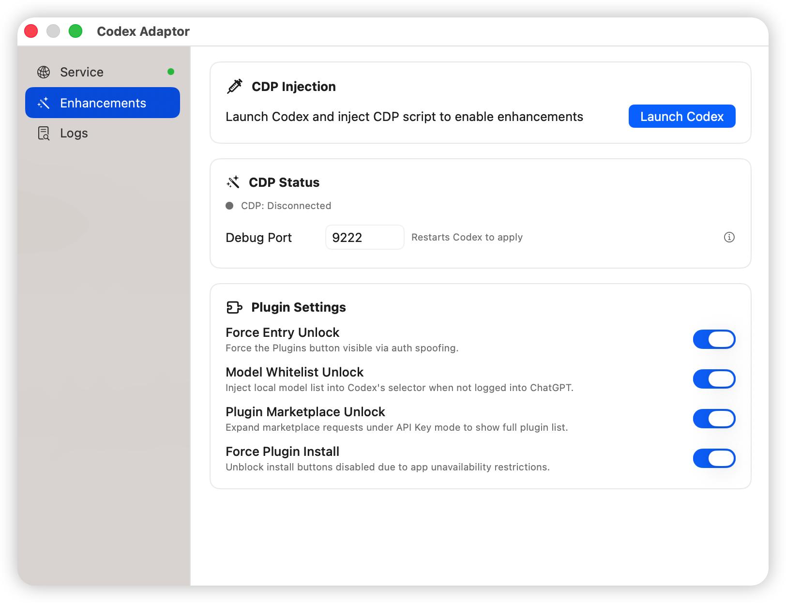
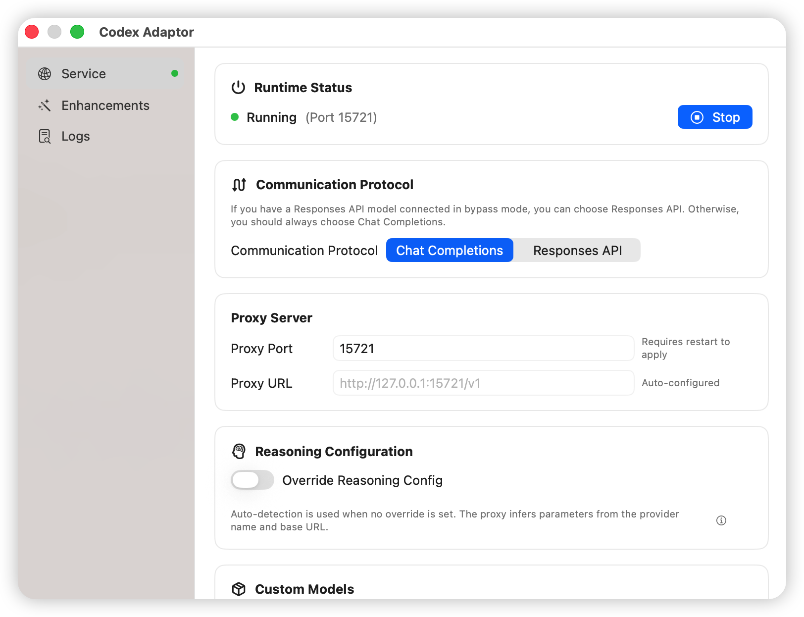
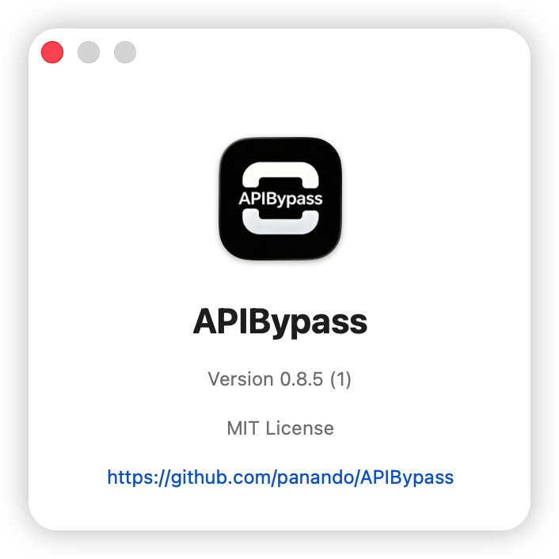

<div align="center">

# APIBypass


**Use Claude Code with DeepSeek. Use ChatGPT app with Qwen. One local proxy, any model, zero hassle.**

APIBypass is a macOS menu bar app that lets you use any AI tool with any model provider. Claude Code with DeepSeek? ChatGPT app with Qwen? Cursor with GLM? Just configure once, and all your tools work with your chosen providers — no need to set up each one separately.

[](LICENSE)
[](https://github.com/panando/APIBypass)
[](https://swift.org)

[Install](#install) ·
[Quickstart](#quickstart) ·
[Features](#features) ·
[Architecture](#architecture) ·
[Settings](#settings)

**English** ·
[简体中文](./README_CN.md)

</div>

---

<p align="center">
  <a href="menu.png"></a>
</p>


### Why APIBypass?

You want to use Claude Code, but it only supports Anthropic's models. You want to use the ChatGPT app, but it's locked to OpenAI. You want to try Cursor, but now you need to configure yet another API key. And every time you switch tools, you start from scratch.

APIBypass solves this at the network layer — one local endpoint, all your tools configured:

- **Format compatibility** — Claude Code speaks Anthropic. Most models speak OpenAI. APIBypass translates automatically, so your tools just work with any provider. No code changes, no patches, no plugins.

- **One config for all tools** — Set up your providers once in APIBypass. Point Claude Code, Cursor, ChatGPT app, or any OpenAI-compatible tool to the same local address. Switching tools? No reconfiguration needed.

- **Credential protection** — Your real API key never leaves your machine. Apps only see a local address and a dummy key. Your actual credentials stay in macOS Keychain, safe and private.

- **Unlock ChatGPT / Codex app** — The ChatGPT desktop app (formerly Codex) uses a new API format that most proxies don't support. APIBypass bridges this gap, letting you use ChatGPT app with DeepSeek, Qwen, GLM, or any provider — not just OpenAI.

- **Claude Code multi-model launcher** — Assign different models to Opus, Sonnet, Haiku, and Subagent roles in Claude Code. One click launches a terminal with everything configured.

- **Model mapping & parameters** — Your client asks for `gpt-4`, APIBypass routes it to `deepseek-chat`. Set temperature, thinking mode, and custom parameters per model — applied automatically to every request.

## Install

### Download (Recommended)

Download the latest `.dmg` from [Releases](https://github.com/panando/APIBypass/releases) and drag APIBypass to Applications. On first launch, allow network connections when prompted.

### Fixing “APIBypass is damaged and can’t be opened” on macOS

The current Release build uses an ad-hoc signature. It is not signed with an Apple Developer ID certificate and is not notarized by Apple. Because of this, macOS Gatekeeper may show:

> “APIBypass” is damaged and can’t be opened. You should move it to the Trash.

This usually does not mean the app is actually corrupted. It means macOS has attached a quarantine flag to a downloaded app that has not been notarized.

#### Option 1: Open from System Settings

1. Try opening APIBypass once.
2. If macOS blocks it, open System Settings → Privacy & Security.
3. In the Security section, look for the APIBypass warning.
4. Click “Open Anyway”.
5. Confirm opening the app.

#### Option 2: Fix with Terminal

If “Open Anyway” does not appear, or macOS still says the app is damaged, first drag APIBypass into the Applications folder. Then open Terminal and run:

```bash
sudo xattr -dr com.apple.quarantine /Applications/APIBypass.app
```

Enter your Mac login password and press Enter. Terminal will not show password characters while typing. This is normal. Then open APIBypass again.

If you are not sure about the app path, type this command with the trailing space:

```bash
sudo xattr -dr com.apple.quarantine 
```

Then drag `APIBypass.app` from Finder into the Terminal window and press Enter.

> Note: Only do this for apps downloaded from sources you trust. If the project obtains an Apple Developer ID certificate in the future, signed and notarized builds will be provided and this manual step will no longer be needed.

### Build from Source

```bash
git clone https://github.com/panando/APIBypass.git
cd APIBypass
swift run      # debug mode
# or
swift build -c release && .build/arm64-apple-macosx/release/APIBypass
```

Requires macOS 14.0+, Swift 6.0+, Xcode 16.0+.

## Quickstart

### 1. Start the Server

Click the APIBypass icon in the menu bar — the server auto-starts on `127.0.0.1:8390`. Green dot = running.

### 2. Add a Provider

Menu bar → "Configure APIBypass" → create a provider:

<p align="center">
  <a href="screenshot_apibypass_configure.png"></a>
</p>

| Field | Description | Example |
|---|---|---|
| Provider Name | A label | `My DeepSeek` |
| API Provider | OpenAI or Anthropic | `OpenAI` |
| Base URL | Upstream API endpoint | `https://api.deepseek.com/v1` |
| API Key | Your upstream key | Stored in Keychain |

### 3. Add Model Mappings

Inside each provider, create mappings:

| Field | Description | Example |
|---|---|---|
| Incoming Model | What your client sends | `claude-sonnet-4-6` |
| Actual Model | What the upstream expects | `deepseek-chat` |

### 4. Point Your Client

Set your AI client's base URL to `http://127.0.0.1:8390/v1`. The API Key field can be anything — APIBypass replaces it with your real key.

### 5. Launch Claude Code (Optional)

Menu bar → "Launch Claude Code":

<p align="center">
  <a href="screenshot_launch_claude_code.png"></a>
</p>

1. Pick a provider (base URL and token auto-configured)
2. Choose a terminal
3. Select models for Anthropic/Opus/Sonnet/Haiku/Subagent roles
4. Set effort level
5. Click "Launch"

Claude Code opens with all environment variables set, routing each model role through your chosen provider.

### 6. Launch ChatGPT / Codex (Optional)

Menu bar → "Launch Codex":

> **Note**: The ChatGPT desktop app was previously called "Codex". APIBypass supports both the new ChatGPT app and the legacy Codex app — the menu item "Launch Codex" works with both.

<p align="center">
  <a href="screenshot_launch_codex.png"></a>
</p>

1. Codex Adaptor service starts automatically if not running
2. Codex app launches with the configured debug port
3. Point Codex to `http://127.0.0.1:15721/v1`

---

## Features

### Anthropic ↔ OpenAI Format Translation

**The core superpower.** Full bidirectional translation of request bodies, responses, SSE event streams, tool calls, and thinking/redacted_thinking blocks. Smart detection: only translates when the client format ≠ provider format.

| Endpoint | Description |
|---|---|
| `POST /v1/chat/completions` | OpenAI Chat Completions |
| `POST /v1/messages` | Anthropic Messages |
| `GET /v1/models` | Model listing |

### Claude Code Multi-Model Launcher

**Break Claude Code's single-model limitation.** Assign different upstream models to each Claude Code role — Opus, Sonnet, Haiku, and Subagent — all in one session.

- 7 terminal options: Terminal.app, iTerm2, Alacritty, Kitty, Warp, Hyper, Warple
- Effort level selector (none → max)
- Cache fix: strips `cch` billing headers, controls `CLAUDE_CODE_ATTRIBUTION_HEADER`
- 1M context fix: auto-appends `[1m]` suffix for long-context models
- Launch templates: save and switch between model configurations

### ChatGPT / Codex App Support — Use Any Provider, Not Just OpenAI

The ChatGPT desktop app (formerly Codex) and the legacy Codex app use a new **Responses API** format that almost no proxy supports. APIBypass is the first macOS tool to bridge this gap: it translates Responses API ↔ Chat Completions in real time, passing requests through model mapping and parameter injection. The result: **ChatGPT / Codex works with any provider, any model** — DeepSeek, Qwen, GLM, MiniMax, not just OpenAI.

<p align="center">
  <a href="screenshot_codexadaptor_configure.png"></a>
</p>

```
Codex ──Responses API──▶ Codex Adaptor (:15721) ──Chat Completions──▶ APIBypass (:8390) ──▶ Upstream
```

**Wire protocol** — Choose between Chat Completions or Responses API as the exposed wire format, with contextual guidance on when to use each.

**Reasoning configuration** — Auto-detect or manually configure thinking/effort parameters per provider. Supports DeepSeek (`thinking`), OpenRouter (`reasoning_effort`), SiliconFlow (`thinking`), MiniMax (`thinking`), Qwen (`enable_thinking`), and more — each with configurable budget tokens and effort levels.

**Custom models** — Define display name aliases mapped to APIBypass model mappings, with configurable context windows. Models are automatically synced to `~/.codex/providers.json` for Codex compatibility.

**CDP Enhancements** — The Codex Electron app exposes a Chrome DevTools Protocol debug port. APIBypass connects to it and injects JavaScript to unlock hidden capabilities:
- Force entry unlock — bypass the waitlist/sign-in gate
- Plugin marketplace unlock — access the plugin marketplace directly
- Force plugin install — install any plugin without restrictions
- Settings are pushed live via WebSocket — changes take effect immediately without restart

**Real-time logs** — Thread-safe ring buffer (2000 entries) displayed via polling timer. Filter by level, copy all, export to file, or clear. No `@Published`/Combine — avoids background-thread AutoLayout crashes.

**Config auto-recovery** — If UserDefaults is cleared, the next launch automatically recovers wire API, reasoning config, and custom models from `~/.codex/providers.json`.

Start from menu bar "Codex Adaptor", point Codex to `http://127.0.0.1:15721/v1`.

### Model Mapping & Parameter Injection

- **Model aliasing**: Any incoming model name → any actual upstream model
- **Parameter injection per mapping**: temperature, max_tokens, top_p, frequency_penalty, presence_penalty
- **Thinking mode toggle**: one-click on/off, compatible with both Anthropic and OpenAI formats
- **Custom JSON injection**: inject arbitrary parameters with automatic type detection (bool, int, float, JSON, string)
- **Local model cleanup**: strips Ollama/LM Studio-specific params before forwarding to cloud APIs

### Provider Management

- Independent provider configs (API type, base URL, API key) — reuse across mappings
- Environment variables per provider for Claude Code integration (manual, model-mapping, keychain, base-url types)
- Auto-migration from legacy format

### Bypass Mode

One-click toggle for pure proxy mode — requests pass through without format translation, keeping model mapping and parameter injection active.

### Security

- API keys in macOS Keychain, never plaintext on disk
- All traffic processed locally — no cloud relay, no telemetry
- Open source, MIT licensed

---

## Architecture

```
ChatGPT / Codex ──▶ Codex Adaptor (:15721) ──▶┐
                                         │
Client (Claude Code / Cursor / Anything) │
    │                                    │
    ▼                                    │
┌────────────────────────────────────────▼┐
│  HTTPServer (Hummingbird 2.0)           │
│  :8390                                  │
│                                          │
│  POST /v1/chat/completions              │
│  POST /v1/messages                      │
│  GET  /v1/models                        │
└──────────────┬──────────────────────────┘
               │
       ┌───────┴────────┐
       ▼                ▼
┌─────────────┐  ┌──────────────────┐
│ ProxyEngine │  │ FormatTranslator │
│ • model map │  │ • req → req      │
│ • param inj │  │ • resp → resp    │
│ • strip loc │  │StreamTranslator  │
└──────┬──────┘  │ • SSE ↔ SSE      │
       │         │Rectifier         │
       │         │ • thinking fix   │
       │         │ • budget fix     │
       │         └────────┬─────────┘
       │                  │
       ▼                  ▼
┌─────────────────────────────────┐
│  Upstream Provider (OpenAI /    │
│  Anthropic / DeepSeek / etc.)   │
└─────────────────────────────────┘
```

---

## Settings

Menu bar → "Settings...":

<p align="center">
  <a href="screenshot_settings.png"></a>
</p>

- **Language**: 中文 / English, takes effect immediately
- **Server Port**: Default 8390, restart to apply
- **Trace Log**: Enable request/response logging for debugging

Menu bar → "About":

<p align="center">
  <a href="screenshot_about.png"></a>
</p>

## Tech Stack

- **SwiftUI** — macOS menu bar app + windows
- **Hummingbird 2.0** — HTTP server
- **Keychain Services** — API key storage with caching
- **async/await** — networking including SSE streaming
- **ServiceLifecycle** — service lifecycle management

---

## Contributing

Contributions are welcome — bug reports, feature ideas, UI/UX polish, translations, and code fixes all help.

- **Bugs & feature requests**: open an [issue](../../issues) with a clear description and reproduction steps.
- **Pull requests**: fork the repo, create a branch, and open a PR against `main`. Keep changes focused and described in the PR description.
- **Translations**: the app is localized via `LocalizationManager`; adding or improving a language is a great first contribution.
- **Discussions**: feel free to start a [discussion](../../discussions) for questions or design ideas before opening a PR.

Please be respectful and constructive. By contributing you agree your contributions are licensed under the project's license.

---

## Star This Project

If APIBypass saves you time, please star the repo — it helps others find it too.
