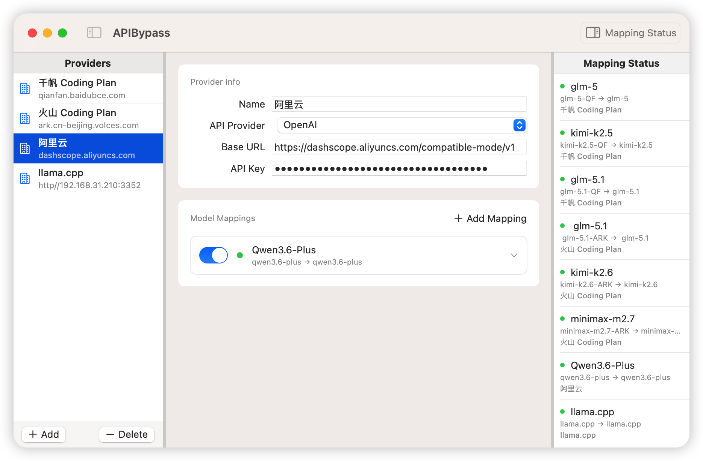
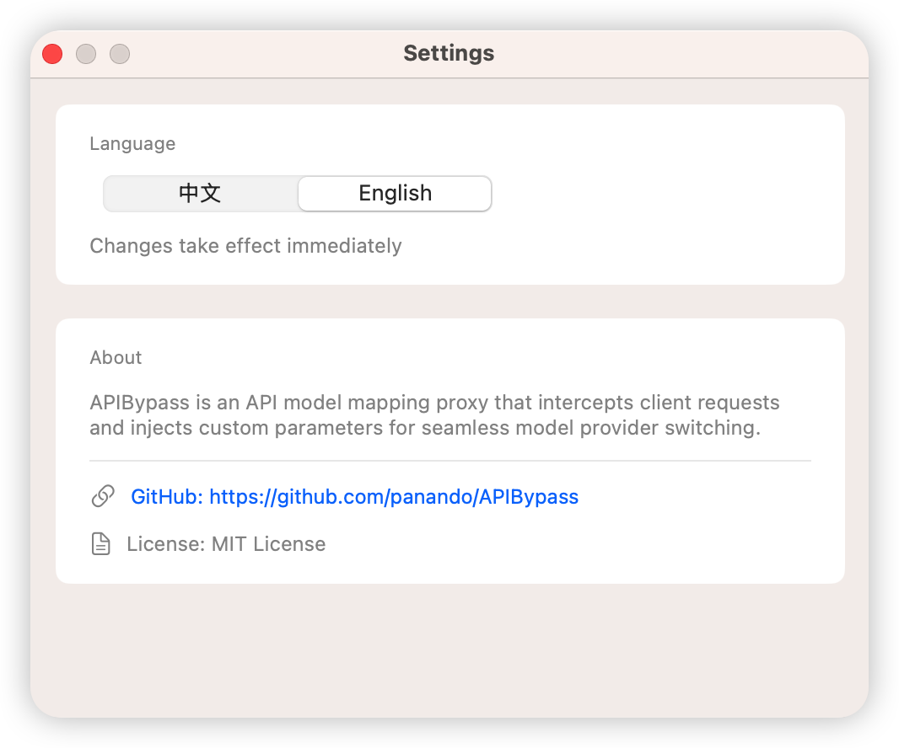

<div align="center">

# APIBypass


A lightweight macOS menu bar app that acts as a local LLM API proxy. Take control of model behavior even when your AI client doesn't expose those settings.

[中文说明](README_CN.md)

</div>

## Why APIBypass?

Many AI clients don't let you customize API request parameters (e.g., disable thinking mode, set temperature, adjust max_tokens). APIBypass runs a local proxy server that intercepts API calls from your client, injects your custom parameters, and forwards them to the real API endpoint.

### Use Cases

- **Closed-source clients**: Some apps don't let you control thinking mode or other parameters. APIBypass injects custom parameters (e.g., `enable_thinking: false`) to override defaults. Works with any OpenAI/Anthropic-compatible API.
- **Parameter injection**: Set temperature, top_p, and other parameters globally without modifying each client.
- **Model name mapping**: Map the model name your client requests to a different actual model — switch models without changing client config.
- **Multi-format support**: Works with both OpenAI Chat Completions and Anthropic Messages APIs.

## Features

### Core Proxy
- Runs in the macOS menu bar — stays out of your Dock
- Local proxy server on `127.0.0.1:8390` (configurable)
- Auto-start server on app launch
- OpenAI Chat Completions API (`/v1/chat/completions`)
- Anthropic Messages API (`/v1/messages`)
- SSE streaming support — real-time forwarding when `stream: true`

### Model Mapping
- Model name mapping (client request name → actual model)
- Multiple configurations, each independently switchable
- Enable/disable individual configurations at the top of each config page
- Right-click context menu: copy config (including API key), delete config
- Delete confirmation dialog to prevent accidental deletion
- Unsaved changes detection and warning when switching configs

### Parameter Injection
- Temperature, Max Tokens, Top P, Frequency Penalty, Presence Penalty
- Thinking mode override: toggle on/off for Anthropic (`thinking` parameter) and OpenAI-compatible APIs (`enable_thinking` parameter)
- Thinking budget control (Anthropic format)
- Custom JSON fields — inject any parameter with any value type (supports strings, numbers, booleans, objects, arrays)

### Security & Privacy
- API Key stored securely in macOS Keychain (single unified storage)
- Single Keychain authorization for all configurations
- All traffic processed locally — no third-party servers involved
- No telemetry or usage data collected

### UI & UX
- Bilingual interface: Chinese (中文) and English, switchable in Settings
- Save button highlights green when changes detected
- Formatted JSON request logging in terminal
- Settings panel with about info, version number, GitHub link (clickable), and License





## System Requirements

- macOS 14.0 or later

## Installation

### Download (Recommended)

Download the latest DMG from the [Releases](https://github.com/panando/APIBypass/releases) page. Mount the DMG and drag APIBypass to your Applications folder. On first launch, allow network connections when prompted.

### Build from Source

Build requirements: Swift 6.0+ / Xcode 16.0+ (or Command Line Tools only)

```bash
git clone https://github.com/panando/APIBypass.git
cd APIBypass

# Run in debug mode
swift run

# Or build release binary
swift build -c release
.build/arm64-apple-macosx/release/APIBypass
```

On first launch, allow network connections when prompted.

## Package

### .app Bundle

> Replace `VERSION` below with the current version (e.g. `0.3.1`).

```bash
VERSION=0.3.1
swift build -c release

# Create .app bundle
mkdir -p APIBypass.app/Contents/MacOS APIBypass.app/Contents/Resources
cp .build/arm64-apple-macosx/release/APIBypass APIBypass.app/Contents/MacOS/
cp icon.icns APIBypass.app/Contents/Resources/AppIcon.icns

cat > APIBypass.app/Contents/Info.plist << 'PLIST'
<?xml version="1.0" encoding="UTF-8"?>
<!DOCTYPE plist PUBLIC "-//Apple//DTD PLIST 1.0//EN" "http://www.apple.com/DTDs/PropertyList-1.0.dtd">
<plist version="1.0">
<dict>
	<key>CFBundleExecutable</key>
	<string>APIBypass</string>
	<key>CFBundleIconFile</key>
	<string>AppIcon</string>
	<key>CFBundleIdentifier</key>
	<string>com.apibypass.app</string>
	<key>CFBundleName</key>
	<string>APIBypass</string>
	<key>CFBundleVersion</key>
	<string>${VERSION}</string>
	<key>CFBundleShortVersionString</key>
	<string>${VERSION}</string>
	<key>CFBundlePackageType</key>
	<string>APPL</string>
	<key>LSMinimumSystemVersion</key>
	<string>14.0</string>
	<key>LSUIElement</key>
	<true/>
	<key>NSHighResolutionCapable</key>
	<true/>
	<key>NSAppTransportSecurity</key>
	<dict>
		<key>NSAllowsLocalNetworking</key>
		<true/>
	</dict>
</dict>
</plist>
PLIST
```

### DMG

```bash
mkdir -p dmg_staging
cp -R APIBypass.app dmg_staging/
ln -s /Applications dmg_staging/Applications

hdiutil create -volname "APIBypass" \
  -srcfolder dmg_staging \
  -ov -format UDZO \
  APIBypass-${VERSION}.dmg

rm -rf dmg_staging
```

## Usage

### 1. Start the Server

Click the APIBypass icon in the menu bar. The server starts automatically on launch, and the indicator turns green when running on `127.0.0.1:8390` (default port, configurable in Settings). You can also manually start/stop via the menu.

### 2. Configure Mappings

Click "Configure..." in the menu bar. Create a model mapping:

| Field | Description | Example |
|---|---|---|
| Config Name | A label for this mapping | `My Custom Config` |
| Incoming Model | The model name your client sends | `qwen3.6-plus` |
| Actual Model | The real model to call upstream | `qwen3.6-plus` |
| API Provider | OpenAI or Anthropic | `OpenAI` |
| Base URL | Upstream API endpoint | `https://api.example.com/v1` |
| API Key | Your upstream API key | Stored in Keychain |

The master enable switch at the top of each config page controls whether that mapping is active.

### 3. Parameter Injection

- **Reasoning Mode Override**: Toggle the master switch to control thinking mode:
  - Enable → inject `enable_thinking: true` (OpenAI) or `thinking: {type: "enabled"}` (Anthropic)
  - Disable → inject `enable_thinking: false` or `thinking: {type: "disabled"}`
  - Turn off → don't touch, use API default
- **Standard Parameters**: Fill in Temperature, Max Tokens, Top P, Frequency Penalty, or Presence Penalty to inject.
- **Custom Fields**: Inject arbitrary JSON key-value pairs. Values are auto-detected: `"true"/"false"` → boolean, `"42"` → integer, `"3.14"` → double, `"{\"key\":\"val\"}"` → JSON object.

### 4. Configure Your Client

Point your AI client to `http://127.0.0.1:8390/v1`. The API Key field can be anything — the proxy replaces it with your real key.

**Example (Cursor):**
```
OpenAI Base URL: http://127.0.0.1:8390/v1
Anthropic Base URL: http://127.0.0.1:8390/v1
```

### 5. Verify (Developers)

When running with `swift run`, watch the terminal for formatted request logs:
- Incoming request body (original)
- Upstream URL and actual model name
- Transformed request body (with injected parameters)

> This step is for developers. Downloaded DMG users do not see terminal output.

## Settings

Access via menu bar "Settings...". The settings panel provides:

- **Language**: Switch between Chinese (中文) and English — takes effect immediately
- **Server Port**: Configure the local proxy port (default 8390, restart required to apply)
- **About**: Version number, project description, GitHub repository link (clickable), and MIT License info

## Project Structure

```
APIBypass/
├── APIBypassApp.swift          # App entry point + menu bar icon
├── Core/
│   ├── ConfigManager.swift     # Config management (UserDefaults)
│   ├── HTTPServer.swift        # Hummingbird HTTP server + SSE streaming
│   ├── LocalizationManager.swift  # i18n: Chinese/English strings
│   └── ProxyEngine.swift       # Request transform engine
├── Models/
│   ├── APIProvider.swift       # API provider enum
│   └── ModelMapping.swift      # Data models
├── Services/
│   ├── KeychainService.swift   # Keychain storage with caching
│   └── NetworkService.swift    # HTTP + streaming network service
├── UI/
│   ├── ConfigWindow.swift      # Config window + new mapping sheet
│   ├── MenuBarView.swift       # Menu bar popup
│   ├── SettingsView.swift      # Settings panel (language + port + about)
│   └── Views/
│       ├── MappingDetailView.swift  # Config detail editor
│       └── MappingListView.swift    # Config list with context menu
└── Package.swift               # Swift Package manifest
```

## Tech Stack

- **SwiftUI** — macOS menu bar app + windows
- **Hummingbird 2.0** — HTTP server framework
- **Keychain Services** — API key secure storage with caching
- **UserDefaults** — Config + language persistence
- **async/await** — Async networking (including SSE streaming)
- **ServiceLifecycle** — Service lifecycle management

## Privacy

- API Keys are stored in the system Keychain and never uploaded anywhere
- All traffic is processed locally — no third-party servers involved
- No telemetry or usage data collected

## License

MIT
