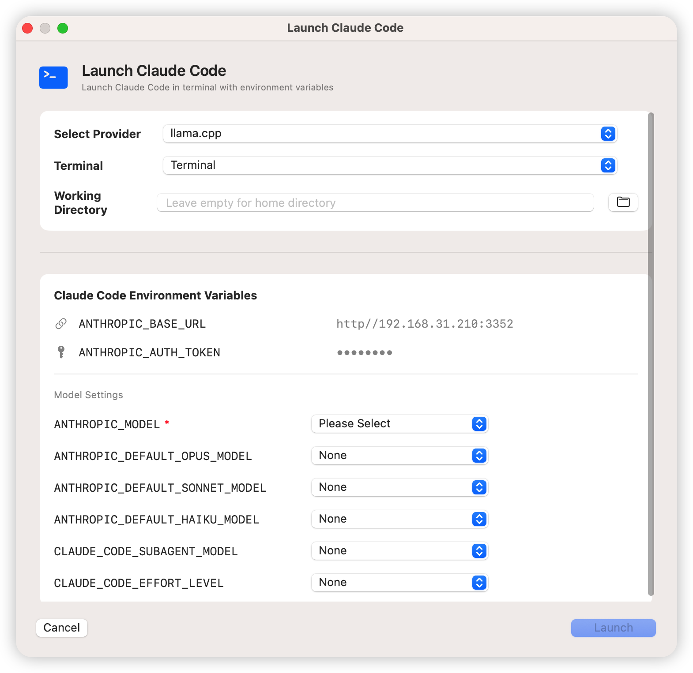

<div align="center">

# APIBypass


**一个地址，接入所有模型，零折腾。**

APIBypass 是一款 macOS 菜单栏应用，充当你的本地大模型 API 网关。只需配置一次，所有 AI 客户端通过同一个地址即可接入你配置的全部模型 —— 自动格式转换、模型映射、参数注入、Claude Code 多模型启动，一站式搞定。

</div>
<p align="center">
  <a href="./README.md">English</a>
  &nbsp;·&nbsp;
  <strong>简体中文</strong>
</p>

## 为什么需要 APIBypass？

> 你是否有过这些烦恼？

- 有多个大模型提供商的 API Key，每个客户端都要手动配置一遍
- 想让 Claude Code 用第三方模型，但它只认 Anthropic 格式
- 不同模型需要不同的 temperature、thinking 参数，改来改去很麻烦
- Claude Code 缓存命中率低、长上下文模型识别有问题
- API Key 散落在各处，安全性堪忧

**APIBypass 一次解决所有问题。**

---

## 核心亮点

### 一站式 API 网关

只需配置一次 BaseURL 和 API Key，你的客户端只需指向 `http://127.0.0.1:8390` —— DeepSeek、Qwen、Kimi、OpenAI、Anthropic…… 所有模型统一入口，告别多处配置。

### 自动格式转换

Claude Code 发 Anthropic 格式？上游是 OpenAI 格式？**自动转换，透明无感。** 请求、响应、SSE 流、工具调用、思考模式 —— 全部自动处理。你的客户端甚至不知道中间经历了一次格式翻译。

### 自定义模型与精细控制

- **模型映射**：客户端请求 `claude-sonnet-4-6`，实际调用你指定的任意模型
- **参数注入**：temperature、max tokens、thinking 模式，统一控制
- **思考模式开关**：一键开启/关闭，兼容 Anthropic 和 OpenAI 格式

### Claude Code 多模型启动器

**打破 Claude Code 的模型限制。** 一键启动 Claude Code，为 Opus、Sonnet、Haiku 等角色分别指定不同提供商的模型 —— 一次会话，多厂商模型协同工作，无缝切换。

### 修复 Claude Code 已知问题

针对 Claude Code 使用第三方模型时的已知兼容性问题进行了修复，包括但不限于缓存命中率优化、长上下文模型识别等，让第三方模型在 Claude Code 中的表现更加稳定可靠。

### 安全与隐私

API Key 存储在 macOS Keychain 中，配置文件无明文密钥。所有流量本地处理，不经过第三方服务器，不收集任何数据。

---





## 功能

### API 格式转换
- 自动 Anthropic ↔ OpenAI 格式转换 —— 请求体、响应、SSE 流、工具调用、思考模式
- 智能检测：只在客户端格式 ≠ 上游提供商格式时转换
- 支持 `/v1/chat/completions`（OpenAI）、`/v1/messages`（Anthropic）、`/v1/responses`（OpenAI Responses API）

### Claude Code 启动器
- 从菜单栏一键启动，自动注入所有环境变量
- **多提供商模型分配**：为 Opus、Sonnet、Haiku 和 Subagent 角色分配不同提供商
- 终端选择：Terminal.app、iTerm2、Alacritty、Kitty、Warp、Hyper
- Effort level 选择器：none、low、medium、high、max
- **缓存修复**：去除 `cch` 计费头，控制 `CLAUDE_CODE_ATTRIBUTION_HEADER`
- **1M 上下文修复**：自动为长上下文模型追加 `[1m]` 后缀

### 提供商管理
- 独立的 Provider 配置（API 类型、Base URL、API Key）
- 模型映射引用提供商 —— 无需重复配置凭证
- 每个提供商可配置环境变量，用于 Claude Code 集成
- 自动从旧格式迁移

### 核心代理
- 运行在 macOS 菜单栏，不占用 Dock 空间
- 本地代理服务器，监听 `127.0.0.1:8390`（可自定义）
- 支持 OpenAI Chat Completions API (`/v1/chat/completions`)
- 支持 Anthropic Messages API (`/v1/messages`)
- 支持 OpenAI Responses API (`/v1/responses`)
- SSE 流式输出支持 — `stream: true` 时实时转发
- Claude Code 兼容模式 — 自动去除 `cch` 计费头、控制 `CLAUDE_CODE_ATTRIBUTION_HEADER` 注入

### 模型映射
- 模型名称映射（客户端请求名 → 实际调用名）
- 支持多组配置，每组可独立启停
- 配置页面顶部独立启停开关
- 右键菜单：复制配置（含 API Key）、删除配置

### 参数注入
- Temperature、Max Tokens、Top P、Frequency Penalty、Presence Penalty
- 思考模式覆盖：一键开启/关闭，兼容 Anthropic（`thinking` 参数）和 OpenAI 兼容 API（`enable_thinking` 参数）
- 思考预算设置（Anthropic 格式）
- 自定义 JSON 参数注入 — 支持字符串、数字、布尔、对象、数组等任意类型

### 安全与隐私
- API Key 安全存储在 macOS Keychain 中，单次授权即可，配置文件无明文密钥
- 所有流量在本地处理，不经过任何第三方服务器
- 不收集任何遥测或使用数据

### 界面与体验
- 双语界面：中文 / English，在设置面板中即时切换
- 三栏布局：提供商边栏、详情编辑器、映射概览
- 终端实时显示格式化 JSON 请求日志
- 设置面板包含关于信息、版本号、GitHub 链接（可点击打开）和许可证信息

## 系统要求

- macOS 14.0 或更高版本

## 安装

### 直接下载（推荐）

从 [Releases](https://github.com/panando/APIBypass/releases) 页面下载最新的 DMG 安装包，双击挂载后将 APIBypass 拖入 Applications 文件夹即可。首次打开时系统会提示授予网络权限，请允许。

### 从源码编译

编译要求：Swift 6.0+ / Xcode 16.0+（或仅安装 Command Line Tools）

```bash
git clone https://github.com/panando/APIBypass.git
cd APIBypass

# 调试模式运行
swift run

# 或编译 release 版本
swift build -c release
.build/arm64-apple-macosx/release/APIBypass
```

首次运行时，系统会提示授予网络权限，请允许。

## 使用说明

### 1. 启动服务

点击菜单栏的 APIBypass 图标。应用启动时服务会自动开启，状态指示灯变绿即表示正在运行，监听 `127.0.0.1:8390`（默认端口，可在设置中修改）。也可通过菜单栏手动启停。

### 2. 配置提供商

点击菜单栏「配置...」，创建提供商：

| 字段 | 说明 | 示例 |
|------|------|------|
| 提供商名称 | 便于识别的名称 | `我的 DeepSeek` |
| API 类型 | OpenAI 或 Anthropic | `OpenAI` |
| Base URL | 上游 API 地址 | `https://api.deepseek.com/v1` |
| API Key | 上游 API 密钥 | 存储在钥匙串中 |

API 类型决定是否需要格式转换：
- 客户端发送 Anthropic 格式但提供商是 OpenAI → 自动转换
- 客户端发送 OpenAI 格式但提供商是 Anthropic → 自动转换
- 格式相同 → 不转换，直接透传

### 3. 配置模型映射

在每个提供商下创建模型映射：

| 字段 | 说明 | 示例 |
|------|------|------|
| 配置名称 | 便于识别的名称 | `Claude Sonnet` |
| 客户端模型名 | 客户端请求的模型名 | `claude-sonnet-4-6` |
| 实际模型名 | 上游 API 的实际模型名 | `deepseek-chat` |

配置页面顶部的启停开关控制该映射是否生效。

### 4. 参数注入

- **更改默认推理模式**：打开总开关后可控制思考模式
  - 启用 → 注入 `enable_thinking: true`（OpenAI）或 `thinking: {type: "enabled"}`（Anthropic）
  - 禁用 → 注入 `enable_thinking: false` 或 `thinking: {type: "disabled"}`
  - 关闭总开关 → 不干预，使用 API 默认行为
- **标准参数**：填入 Temperature、Max Tokens、Top P、Frequency Penalty、Presence Penalty 即可注入
- **自定义参数**：可注入任意 JSON 字段，值自动识别类型：`"true"/"false"` → 布尔值、`"42"` → 整数、`"3.14"` → 浮点数、`"{\"key\":\"val\"}"` → JSON 对象

### 5. 启动 Claude Code

点击菜单栏「启动 Claude Code」：
1. 选择提供商（Base URL 和 API Token 自动配置）
2. 选择终端
3. 选择 `ANTHROPIC_MODEL` 对应的模型（必填）
4. 可选配置 Opus/Sonnet/Haiku/Subagent 模型默认值
5. 设置 effort level（none、low、medium、high、max）
6. 可选设置工作目录
7. 点击「启动」— Claude Code 在终端中打开，所有环境变量已设置

### 6. 配置客户端（手动）

如果不使用启动器，将 AI 客户端的 API 地址改为 `http://127.0.0.1:8390/v1`：

**Cursor 示例：**
```
OpenAI Base URL: http://127.0.0.1:8390/v1
Anthropic Base URL: http://127.0.0.1:8390/v1
```

API Key 填写任意值（代理会替换为真实 Key）。

### 7. 验证生效（开发者）

使用 `swift run` 运行时，在终端查看格式化请求日志：
- 原始请求体
- 上游 URL 和实际模型名
- 转换后的请求体（含注入的参数）
- 格式转换状态（如适用）

> 此步骤仅适用于开发者，直接下载 DMG 安装的用户不会看到终端输出。

## 设置面板

通过菜单栏「设置...」打开。设置面板提供：

- **语言**：切换中文 / English，修改后立即生效
- **服务端口**：配置本地代理端口（默认 8390，修改后需重启服务生效）
- **关于**：版本号、项目简介、GitHub 仓库链接（可点击跳转）、MIT 许可证信息

## 项目结构

```
APIBypass/
├── APIBypassApp.swift          # 应用入口 + 菜单栏图标
├── Core/
│   ├── ConfigManager.swift     # 配置管理（UserDefaults 持久化）
│   ├── FormatTranslator.swift  # Anthropic ↔ OpenAI 请求/响应转换
│   ├── HTTPServer.swift        # Hummingbird HTTP 服务器 + SSE 流式
│   ├── LocalizationManager.swift  # 国际化：中英文切换
│   ├── ProxyEngine.swift       # 请求转换引擎（参数注入）
│   └── StreamTranslator.swift  # SSE 流式格式转换
├── Models/
│   ├── APIProvider.swift       # API 提供商枚举
│   ├── ProviderConfig.swift    # 提供商 + 环境变量
│   ├── ModelMapping.swift      # 数据模型
│   └── RectifierModels.swift   # Claude Code 兼容性辅助工具
├── Services/
│   ├── ClaudeCodeLauncher.swift  # 终端检测 + 启动
│   ├── KeychainService.swift   # Keychain 安全存储（带缓存）
│   └── NetworkService.swift    # HTTP + 流式网络请求服务
├── UI/
│   ├── ConfigWindow.swift      # 配置窗口 + 新建映射弹窗
│   ├── MenuBarView.swift       # 菜单栏下拉视图
│   ├── SettingsView.swift      # 设置面板（语言 + 端口 + 关于）
│   └── Views/
│       ├── EnvironmentVariablesCard.swift  # 提供商环境变量配置
│       ├── LaunchClaudeCodeView.swift      # Claude Code 启动器界面
│       ├── MappingCardView.swift           # 可展开的映射卡片
│       ├── MappingDetailView.swift         # 配置详情编辑器
│       ├── MappingEditForm.swift           # 共享表单组件
│       ├── MappingListView.swift           # 配置列表（右键菜单）
│       ├── NewMappingView.swift            # 新建映射弹窗
│       ├── NewProviderView.swift           # 新建提供商弹窗
│       └── ProviderDetailView.swift        # 提供商详情编辑器
└── Package.swift               # Swift Package 配置
```

## 技术栈

- **SwiftUI** — macOS 菜单栏应用 + 窗口管理
- **Hummingbird 2.0** — HTTP 服务器框架
- **Keychain Services** — API Key 安全存储（带内存缓存）
- **UserDefaults** — 配置 + 语言偏好持久化
- **async/await** — 异步网络操作（含 SSE 流式）
- **ServiceLifecycle** — 服务生命周期管理

## 隐私

- API Key 存储在系统钥匙串中，不上传到任何地方
- 所有流量在本地处理，不经过任何第三方服务器
- 不收集任何遥测或使用数据

## 给项目点个 Star

如果这个项目对你有帮助，请给个 Star 支持一下，谢谢！
