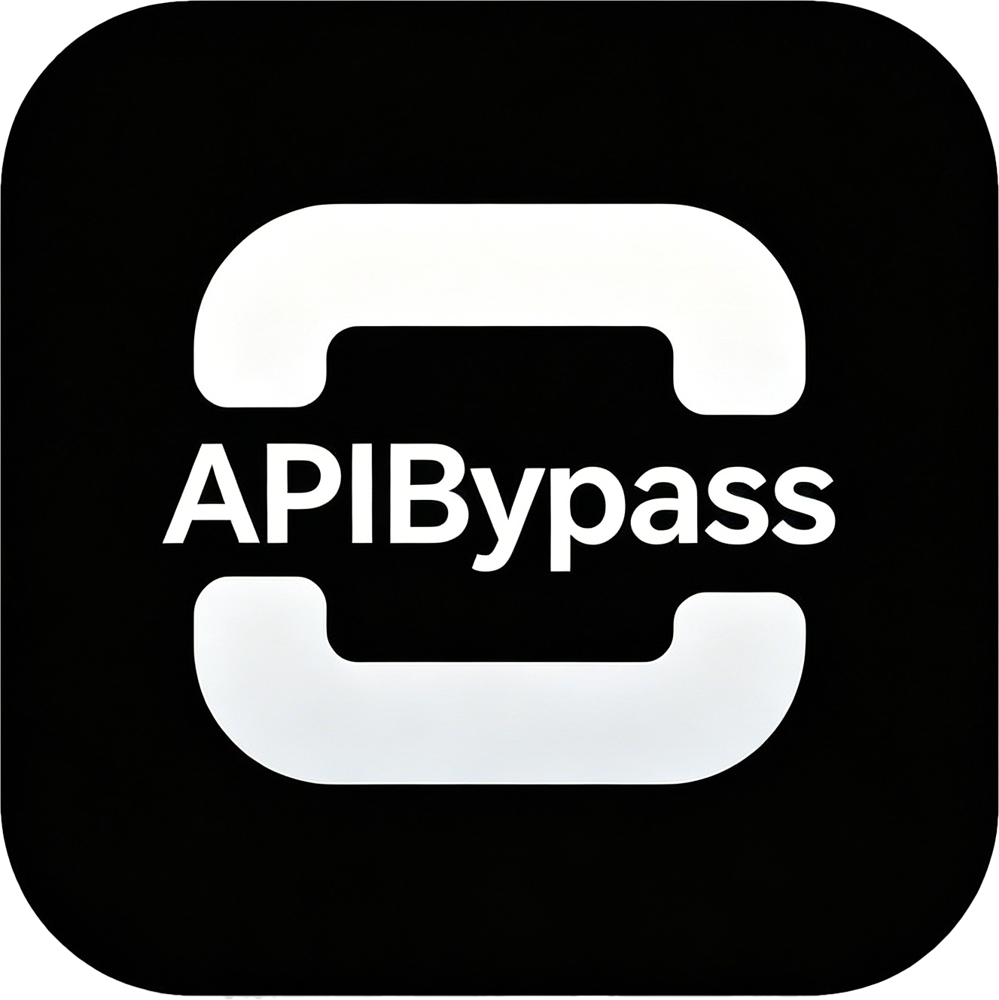
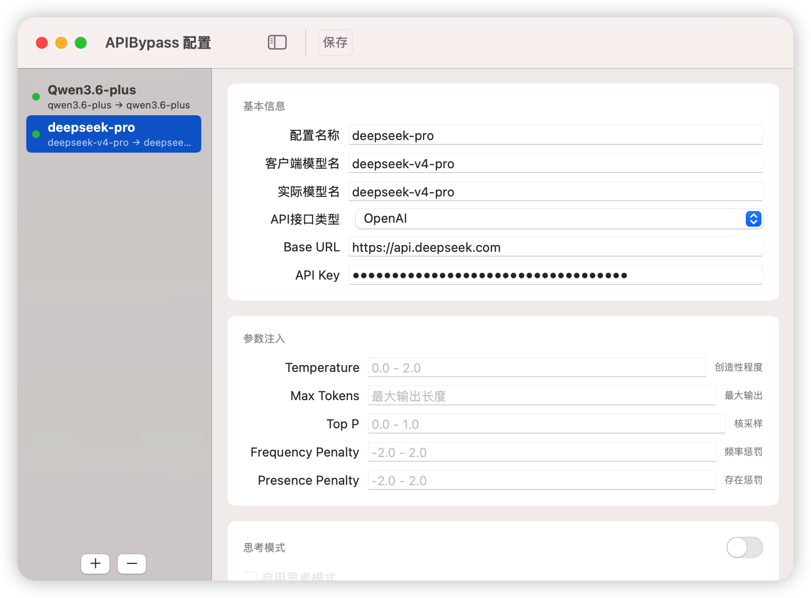

<div align="center">

# APIBypass



一个运行在 macOS 菜单栏的轻量级 LLM API 代理工具。让不支持自定义参数的 AI 客户端软件也能自由控制模型行为。

</div>

## 为什么需要 APIBypass？

很多 AI 客户端不允许自定义 API 请求参数（如关闭思考模式、调整 temperature、设置 max_tokens 等）。APIBypass 在你的本地启动一个代理服务器，拦截客户端发出的 API 请求，注入你配置的参数后再转发给真正的 API 服务端。

### 典型场景

- **闭源客户端**：某些软件调用 DeepSeek/Qwen3 等模型时无法关闭思考模式，通过 APIBypass 注入 `enable_thinking: false` 即可强制关闭
- **参数注入**：为所有请求统一设置 temperature、top_p 等参数，无需修改客户端
- **模型映射**：将客户端请求的模型名映射到实际模型名，方便切换模型而无需修改客户端配置
- **多 API 格式**：同时支持 OpenAI Chat Completions 和 Anthropic Messages 两种 API 格式

## 功能

- 运行在 macOS 菜单栏，不占用 Dock 空间
- 本地代理：监听 `127.0.0.1:8390`
- 支持 OpenAI Chat Completions API (`/v1/chat/completions`)
- 支持 Anthropic Messages API (`/v1/messages`)
- 模型名称映射（客户端请求名 → 实际调用名）
- 参数注入：temperature、max_tokens、top_p、frequency_penalty、presence_penalty
- 思考模式控制：一键开启/关闭，兼容 Anthropic（`thinking` 参数）和 OpenAI 兼容 API（`enable_thinking` 参数）
- 自定义 JSON 参数注入，支持任意结构的参数值
- API Key 安全存储在 macOS Keychain 中
- 请求日志，便于调试



## 系统要求

- macOS 14.0 或更高版本

## 编译要求

仅从源码编译时需要：

- Swift 6.0+ / Xcode 16.0+（或仅安装 Command Line Tools）

## 编译和运行

```bash
git clone https://github.com/panando/APIBypass.git
cd APIBypass

# 调试模式运行
swift run

# 或编译 release 版本
swift build -c release
.build/arm64-apple-macosx/release/APIBypass
```

首次运行时，系统会提示授予网络权限，请允许。

## 打包

### .app 包

> 将 `VERSION` 替换为当前版本号（如 `0.1.3`）。

```bash
VERSION=0.1.3
swift build -c release

# 创建 .app 包
mkdir -p APIBypass.app/Contents/MacOS APIBypass.app/Contents/Resources
cp .build/arm64-apple-macosx/release/APIBypass APIBypass.app/Contents/MacOS/
cp icon.icns APIBypass.app/Contents/Resources/AppIcon.icns

cat > APIBypass.app/Contents/Info.plist << 'PLIST'
<?xml version="1.0" encoding="UTF-8"?>
<!DOCTYPE plist PUBLIC "-//Apple//DTD PLIST 1.0//EN" "http://www.apple.com/DTDs/PropertyList-1.0.dtd">
<plist version="1.0">
<dict>
	<key>CFBundleExecutable</key>
	<string>APIBypass</string>
	<key>CFBundleIconFile</key>
	<string>AppIcon</string>
	<key>CFBundleIdentifier</key>
	<string>com.apibypass.app</string>
	<key>CFBundleName</key>
	<string>APIBypass</string>
	<key>CFBundleVersion</key>
	<string>${VERSION}</string>
	<key>CFBundleShortVersionString</key>
	<string>${VERSION}</string>
	<key>CFBundlePackageType</key>
	<string>APPL</string>
	<key>LSMinimumSystemVersion</key>
	<string>14.0</string>
	<key>LSUIElement</key>
	<true/>
	<key>NSHighResolutionCapable</key>
	<true/>
	<key>NSAppTransportSecurity</key>
	<dict>
		<key>NSAllowsLocalNetworking</key>
		<true/>
	</dict>
</dict>
</plist>
PLIST
```

### DMG

```bash
mkdir -p dmg_staging
cp -R APIBypass.app dmg_staging/
ln -s /Applications dmg_staging/Applications

hdiutil create -volname "APIBypass" \
  -srcfolder dmg_staging \
  -ov -format UDZO \
  APIBypass-${VERSION}.dmg

rm -rf dmg_staging
```

## 使用说明

### 1. 启动服务

点击菜单栏的 APIBypass 图标，选择「启动服务」。状态指示灯变绿即表示服务已启动，监听 `127.0.0.1:8390`。

### 2. 配置映射

点击菜单栏「打开配置...」，在配置窗口中创建模型映射：

| 字段 | 说明 | 示例 |
|------|------|------|
| 配置名称 | 便于识别的名称 | `Qwen3 关闭思考` |
| 客户端模型名 | 客户端请求的模型名 | `qwen3.6-plus` |
| 实际模型名 | 上游 API 的实际模型名 | `qwen3.6-plus` |
| API接口类型 | OpenAI 或 Anthropic | `OpenAI` |
| Base URL | 上游 API 地址 | `https://api.example.com/v1` |
| API Key | 上游 API 密钥 | 存储在钥匙串中 |

### 3. 参数注入

- **Temperature / Max Tokens / Top P / Frequency Penalty / Presence Penalty**：直接填入数值即可注入
- **思考模式**：打开总开关后可配置
  - 启用思考模式（勾选）→ 注入启用参数
  - 关闭思考模式（取消勾选）→ 注入禁用参数
  - 关闭总开关 → 不干预，使用 API 默认行为
- **自定义参数**：可注入任意 JSON 字段，值支持字符串、数字、布尔、对象等格式

### 4. 配置客户端

将 AI 客户端的 API 地址改为 `http://127.0.0.1:8390/v1`，API Key 填写任意值（代理会替换为真实 Key）。

**Cursor 示例：**
```
OpenAI Base URL: http://127.0.0.1:8390/v1
Anthropic Base URL: http://127.0.0.1:8390/v1
```

### 5. 验证生效

运行时在终端查看 `[APIBypass]` 前缀的日志，可以看到：
- 原始请求体
- 转换后的请求体（含注入的参数）
- 上游 API 地址

## 项目结构

```
APIBypass/
├── APIBypassApp.swift          # 应用入口
├── Core/
│   ├── ConfigManager.swift     # 配置管理（UserDefaults 持久化）
│   ├── HTTPServer.swift        # Hummingbird HTTP 服务器
│   └── ProxyEngine.swift       # 请求转换引擎（参数注入）
├── Models/
│   ├── APIProvider.swift       # API 提供商枚举
│   └── ModelMapping.swift      # 数据模型
├── Services/
│   ├── KeychainService.swift   # Keychain 安全存储
│   └── NetworkService.swift    # 网络请求服务
├── UI/
│   ├── ConfigWindow.swift      # 配置窗口 + 新建映射
│   ├── MenuBarView.swift       # 菜单栏视图
│   └── Views/
│       └── MappingDetailView.swift  # 映射详情编辑
└── Package.swift               # Swift Package 配置
```

## 技术栈

- **SwiftUI** — macOS 菜单栏应用
- **Hummingbird 2.0** — HTTP 服务器框架
- **Keychain Services** — API Key 安全存储
- **UserDefaults** — 配置持久化
- **async/await** — 异步网络操作
- **ServiceLifecycle** — 服务生命周期管理

## 隐私

- API Key 存储在系统钥匙串中，不上传到任何地方
- 所有流量在本地处理，不经过任何第三方服务器
- 不收集任何遥测或使用数据

## License

MIT
